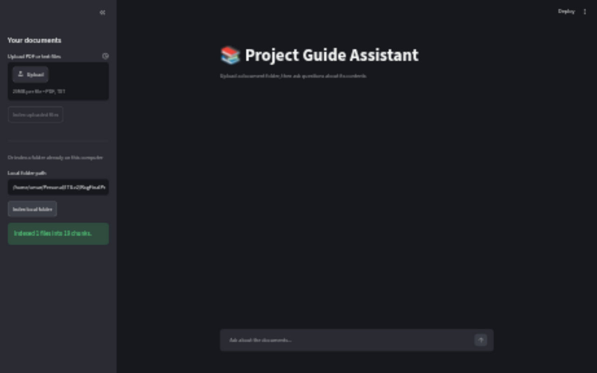
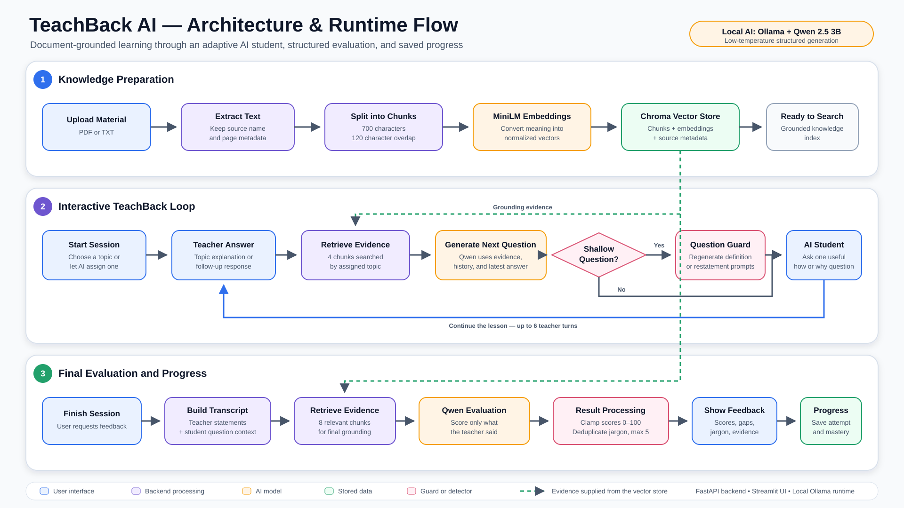

# The learning gap

## Passive review can feel like mastery

- **Explain** a topic instead of recognizing familiar words
- **Defend** the explanation through contextual follow-up questions
- **Improve** using evidence-grounded feedback and repeated attempts

> **Core idea:** To teach is to learn twice.

::: notes
Open with the problem: students often mistake recognition for mastery. TeachBack AI asks them to produce, defend, and improve an explanation instead.
:::

# One focused learning workflow

| 1. Ground | 2. Teach | 3. Evaluate | 4. Improve |
|:--|:--|:--|:--|
| Upload PDF/TXT notes | Choose a topic and audience | Score the full conversation | Correct a mistake or reteach |
| Extract and index text | Explain for up to six turns | Find gaps, misconceptions, and jargon | Compare attempts over time |

The same indexed documents support topic generation, contextual questions, cited answers, final evaluation, and progress tracking.

::: notes
Emphasize that this is more than document chat. The user teaches, the AI asks substantive questions, and the final feedback is grounded in the source material.
:::

# The product experience

{width=11.8in}

::: notes
Point out the three tabs: TeachBack session, Ask the documents, and Progress. The sidebar accepts PDF/TXT uploads or a local folder.
:::

# Architecture and runtime flow

{width=11.9in}

::: notes
Walk through the three layers: knowledge preparation, the interactive TeachBack loop, and final evaluation. Green dashed lines show retrieved evidence supplied from ChromaDB.
:::

# Feedback designed for action

- **Scoring:** accuracy, clarity, completeness, and overall mastery
- **Diagnosis:** correct points, missing ideas, and misconceptions
- **Audience awareness:** unexplained jargon paired with simpler wording
- **Active practice:** mistake correction, citations, and progress across attempts

::: notes
Show an evaluated session during the demo. Expand the improved explanation and evidence, then open the mistake-correction challenge.
:::

# Local-first RAG implementation

| Layer | Technology |
|:--|:--|
| Interface | Streamlit |
| API | FastAPI |
| Extraction | PyPDF + plain text |
| Embeddings | all-MiniLM-L6-v2 |
| Retrieval | ChromaDB |
| Generation | Ollama + Qwen 2.5 3B |

**Validated:** 15/15 automated tests pass; 9/10 saved RAG checks meet the expected result.

::: notes
The system runs locally, which keeps the learning material and generation workflow on the user's machine. Mention that the remaining saved evaluation miss is visible in evaluation/results.csv rather than hidden.
:::

# Demo: from upload to mastery

1. Upload course notes and start an AI-assigned topic.
2. Teach, answer a contextual follow-up, and finish the session.
3. Review feedback, correct a mistake, and show saved progress.

> **Takeaway:** Personal documents become an evidence-grounded AI student that exposes gaps and helps learners build mastery.

::: notes
Close by returning to the core idea: understanding becomes visible when a learner can teach, answer follow-ups, and correct mistakes using evidence.
:::
