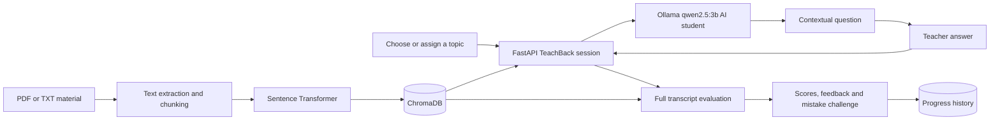

# TeachBack AI

A RAG-based learning assistant built around the idea that "to teach is to learn twice." Students upload PDF or text learning material, hold a multi-turn teaching conversation with a curious AI student, receive document-grounded feedback, correct an intentional mistake, and track their mastery over repeated attempts.

## Main features

- Chat with uploaded learning material and view page citations
- Choose a topic to teach or let the AI assign one from the documents
- Teach different audiences: a child, beginner, classmate, professor or interviewer
- Answer contextual how, why, next-step and concrete-case questions from a curious AI student
- Receive accuracy, clarity, completeness and mastery scores
- Find missing points and misconceptions
- Detect up to five unique unexplained terms and suggest simpler wording
- Correct a believable mistake created by the AI student
- Start another session on a topic and compare attempts
- Track mastered and weak topics in a progress dashboard

## Architecture



## Tech stack

- Python 3.12
- PyPDF, Sentence Transformers and ChromaDB
- Ollama with `qwen2.5:3b`
- FastAPI and Streamlit
- Pytest

## Project structure

```text
notebooks/                 RAG pipeline and evaluation
data/source_documents/    Optional local learning material
backend/app/               FastAPI application
backend/data/vector_store/ Persisted Chroma database
backend/tests/             API tests
frontend/                  Streamlit learning application
evaluation/                Saved ten-question results
PRESENTATION.md            Demo and recording outline
```

## RAG and TeachBack method

The user supplies PDF or TXT learning material. Text is split into 700-character chunks with 120 characters of overlap. The overlap helps ideas near a chunk boundary stay together.

Embeddings use `sentence-transformers/all-MiniLM-L6-v2`. Relevant chunks are added to a strict prompt that asks Ollama to use only the supplied material. During a TeachBack session, the user can choose a topic or ask the app to assign one from the indexed material. The app then plays a curious student and asks one short question after each teacher response. Questions use the conversation and retrieved material to build on a concrete part of the latest answer, stay within the assigned topic and avoid shallow requests to repeat or define the same words.

When the user finishes the conversation, the model evaluates the full transcript while scoring only the teacher's statements; the AI student's questions are retained as context. It produces accuracy, clarity and completeness scores, identifies knowledge gaps and misconceptions, deduplicates unexplained jargon, and writes a clearer example explanation. Each completed attempt is saved locally for the dashboard.

### TeachBack workflow

1. Upload PDF/TXT material or index a local folder.
2. Select an audience and either enter a topic or let the AI assign one from the indexed material.
3. Explain the topic and answer the AI student's contextual questions. The Streamlit interface allows up to six teacher turns per session.
4. Select **Finish and evaluate** to score the complete teaching transcript against retrieved document evidence.
5. Review the feedback, try the mistake-correction challenge or start another session.

### Vector store schema

| Field | Type | Meaning |
|---|---|---|
| `id` | string | Document, page and chunk identifier |
| `document` | string | Extracted chunk text |
| `source` | string | Original filename |
| `page` | integer | PDF page number |
| `chunk` | integer | Chunk number on the page |

## Setup

Requirements: Python 3.12, Git and a running Ollama installation.

```bash
git clone <repository-url>
cd RagFinalProject
python -m venv .venv
source .venv/bin/activate
pip install -r requirements.txt
pip install -r backend/requirements.txt
pip install -r frontend/requirements.txt
ollama pull qwen2.5:3b
```

Run the notebook once to rebuild the vector database if needed:

```bash
jupyter notebook notebooks/rag_pipeline.ipynb
```

Copy the environment examples:

```bash
cp backend/.env.example backend/.env
cp frontend/.env.example frontend/.env
```

Start the backend from one terminal:

```bash
source .venv/bin/activate
cd backend
uvicorn app.main:app --reload
```

Start the frontend from another terminal:

```bash
source .venv/bin/activate
cd frontend
streamlit run app.py
```

Open `http://localhost:8501`. API documentation is at `http://localhost:8000/docs`.

Use the sidebar to upload several PDF/TXT files, or paste the path of a local folder and click **Index local folder**. A new upload replaces the current document index.

## Environment variables

| Variable | Example | Purpose |
|---|---|---|
| `OLLAMA_BASE_URL` | `http://localhost:11434` | Ollama server |
| `OLLAMA_MODEL` | `qwen2.5:3b` | Local generation model |
| `EMBEDDING_MODEL` | `sentence-transformers/all-MiniLM-L6-v2` | Embedding model |
| `VECTOR_STORE_PATH` | `data/vector_store` | Chroma database path |
| `PROGRESS_FILE` | `data/teachback_progress.json` | Saved TeachBack attempts |
| `COLLECTION_NAME` | `project_guide` | Chroma collection |
| `FRONTEND_ORIGIN` | `http://localhost:8501` | Allowed browser origin |
| `TOP_K` | `6` | Retrieved chunks per question |
| `API_BASE_URL` | `http://localhost:8000` | Frontend API address |

## API

| Method | Endpoint | Purpose |
|---|---|---|
| `GET` | `/health` | Check service and index status |
| `POST` | `/query` | Ask a document-grounded question |
| `POST` | `/upload` | Upload and index PDF/TXT files |
| `POST` | `/index-folder` | Index a local document folder |
| `POST` | `/teachback/topics` | Generate topics from the material |
| `POST` | `/teachback/start` | Start a dialogue with a chosen or AI-assigned topic |
| `POST` | `/teachback/turn` | Return the AI student's next contextual question |
| `POST` | `/teachback/evaluate` | Score and evaluate an explanation or full transcript |
| `POST` | `/teachback/challenge` | Create an intentional mistake |
| `POST` | `/teachback/correction` | Check the student's correction |
| `GET` | `/teachback/progress` | Return saved attempts and summary |

```bash
curl -X POST http://localhost:8000/upload \
  -F "files=@document.pdf" \
  -F "files=@notes.txt"
```

```bash
curl -X POST http://localhost:8000/query \
  -H "Content-Type: application/json" \
  -d '{"question":"What must the frontend include?"}'
```

Example response:

```json
{
  "answer": "The frontend needs a chat interface and must show cited sources.",
  "sources": ["course_notes.pdf, page 4"]
}
```

Start a TeachBack session without a `topic` to let the AI choose one, or include a topic of your own:

```bash
curl -X POST http://localhost:8000/teachback/start \
  -H "Content-Type: application/json" \
  -d '{"audience":"A beginner","topic":"Supervised learning"}'
```

Send the conversation after each teacher response to get the AI student's next question:

```bash
curl -X POST http://localhost:8000/teachback/turn \
  -H "Content-Type: application/json" \
  -d '{
    "topic": "Supervised learning",
    "audience": "A beginner",
    "conversation": [
      {"role": "student", "content": "Could you explain supervised learning to me?"},
      {"role": "teacher", "content": "It learns patterns from examples that include the correct answers."}
    ]
  }'
```

The final conversation is submitted to `/teachback/evaluate` as the `explanation` field. Its limit is 16,000 characters; an individual `/teachback/turn` message is limited to 2,000 characters, and the API accepts up to 20 conversation messages.

## Evaluation

The original RAG evaluation results remain available in `evaluation/results.csv`. TeachBack responses use the same retrieved page evidence, and the progress dashboard stores the overall score from each attempt.

## Tests

```bash
cd backend
pytest
```

The tests cover document questions, uploads, local folder indexing, topic generation, TeachBack session start and dialogue turns, transcript evaluation, jargon deduplication, saved progress, mistake challenges and corrections.

The setup and tests were also checked from a fresh local clone of the repository.

## Presentation

The live-demo order and recording outline are in `PRESENTATION.md`.

## Screenshot


