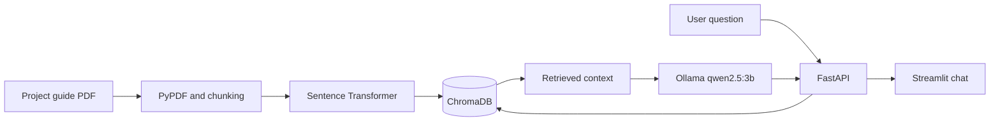

# Project Guide RAG Assistant

A small Retrieval-Augmented Generation application that answers questions about the Level 2 graduation project guide. Answers are generated by a local Ollama model and include the pages used as sources.

## Architecture



## Tech stack

- Python 3.12
- PyPDF, Sentence Transformers and ChromaDB
- Ollama with `qwen2.5:3b`
- FastAPI and Streamlit
- Pytest

## Project structure

```text
notebooks/                 RAG pipeline and evaluation
data/source_documents/    Source PDF
backend/app/               FastAPI application
backend/data/vector_store/ Persisted Chroma database
backend/tests/             API tests
frontend/                  Streamlit chat application
evaluation/                Saved ten-question results
PRESENTATION.md            Demo and recording outline
```

## Data and method

The corpus contains the five-page `Graduation_Project_L2.pdf`. It explains the RAG assignment phases, required file structure, API, interface, evaluation, GitHub submission and common mistakes. Text is split into 700-character chunks with 120 characters of overlap. The overlap helps requirements near a chunk boundary stay together.

Embeddings use `sentence-transformers/all-MiniLM-L6-v2`. The six closest chunks are added to a strict prompt that asks Ollama to use only the supplied text.

### Vector store schema

| Field | Type | Meaning |
|---|---|---|
| `id` | string | Document, page and chunk identifier |
| `document` | string | Extracted chunk text |
| `source` | string | Original filename |
| `page` | integer | PDF page number |
| `chunk` | integer | Chunk number on the page |

## Setup

Requirements: Python 3.12, Git and a running Ollama installation.

```bash
git clone <repository-url>
cd RagFinalProject
python -m venv .venv
source .venv/bin/activate
pip install -r requirements.txt
pip install -r backend/requirements.txt
pip install -r frontend/requirements.txt
ollama pull qwen2.5:3b
```

Run the notebook once to rebuild the vector database if needed:

```bash
jupyter notebook notebooks/rag_pipeline.ipynb
```

Copy the environment examples:

```bash
cp backend/.env.example backend/.env
cp frontend/.env.example frontend/.env
```

Start the backend from one terminal:

```bash
source .venv/bin/activate
cd backend
uvicorn app.main:app --reload
```

Start the frontend from another terminal:

```bash
source .venv/bin/activate
cd frontend
streamlit run app.py
```

Open `http://localhost:8501`. API documentation is at `http://localhost:8000/docs`.

## Environment variables

| Variable | Example | Purpose |
|---|---|---|
| `OLLAMA_BASE_URL` | `http://localhost:11434` | Ollama server |
| `OLLAMA_MODEL` | `qwen2.5:3b` | Local generation model |
| `EMBEDDING_MODEL` | `sentence-transformers/all-MiniLM-L6-v2` | Embedding model |
| `VECTOR_STORE_PATH` | `data/vector_store` | Chroma database path |
| `COLLECTION_NAME` | `project_guide` | Chroma collection |
| `FRONTEND_ORIGIN` | `http://localhost:8501` | Allowed browser origin |
| `TOP_K` | `6` | Retrieved chunks per question |
| `API_BASE_URL` | `http://localhost:8000` | Frontend API address |

## API

`GET /health` reports whether the retriever loaded. `POST /query` accepts a question and returns an answer and its sources.

```bash
curl -X POST http://localhost:8000/query \
  -H "Content-Type: application/json" \
  -d '{"question":"What must the frontend include?"}'
```

Example response:

```json
{
  "answer": "The frontend needs a chat interface and must show cited sources.",
  "sources": ["Graduation_Project_L2.pdf, page 4"]
}
```

## Evaluation

The notebook includes ten questions covering setup, notebook work, the API, frontend and submission. Nine passed both the keyword and grounding checks, and all ten answers included citations. The saved table is also available in `evaluation/results.csv`.

Main failure case: the broad Git ignore question retrieved the correct GitHub section but the small local model skipped part of its list. Page metadata, overlapping chunks and six retrieved results improved the other answers. The strict prompt tells the model not to make up missing information.

## Tests

```bash
cd backend
pytest
```

The tests cover a successful query and invalid empty input.

The setup and tests were also checked from a fresh local clone of the repository.

## Presentation

The live-demo order and a short recording script are in `PRESENTATION.md`.

## Screenshot

Before submission, run both applications and save a chat screenshot as `assets/app-screenshot.png`, then add it here.
